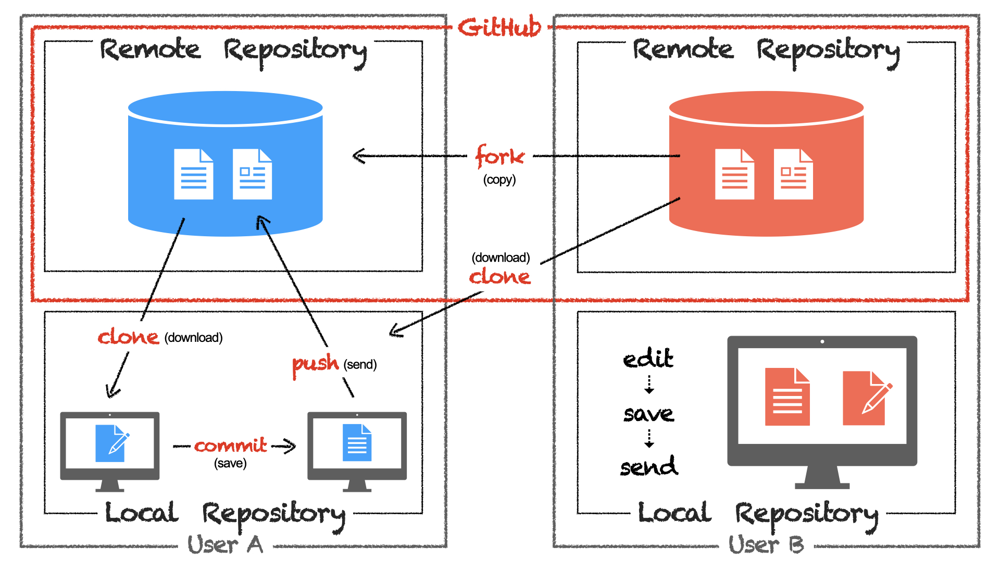

# ゼロからわかる GitHub 入門 Lesson01

## git の仕組みと GitHub

### フォルダやファイルがどのように管理されるのか

ここでは長くは説明しません.3 分くらい画像を見つめてください.

git では横文字がたくさん出てきます.特に赤い文字を見つめておきましょう.

よく出てくる**Repository**はフォルダと同じような意味合いということだけ覚えておきましょう.

ここは見つめるだけで終わりです.

[次の Lesson へ](/lesson02)
